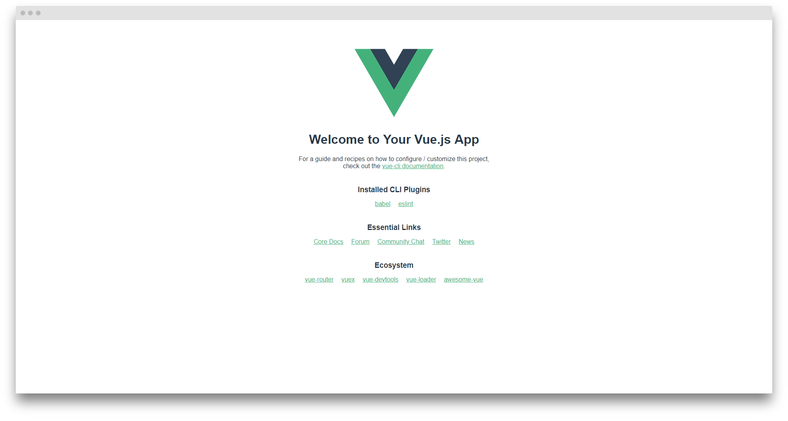

## 使用 @vue/cli 构建项目
> 安装 vue/cli 首先的安装 node8.9版本以上
* `npm install -g @vue/cli` 安装
* `vue --version`   检测安装版本

## 创建一个项目
* `vue create hello-world` 创建一个 hello-world 项目
* `npm run serve` 开启服务

```c
  DONE  Compiled successfully in 5210ms                                                                                15:59:32

   App running at:
   - Local:   http://localhost:8080/
   - Network: http://192.168.1.105:8080/
 
   Note that the development build is not optimized.
   To create a production build, run npm run build.
```

### 出现上图说明启动服务成功了
* `http://localhost:8080/` 浏览器访问 8080 端口




### 愉快的开始 vue 之旅

